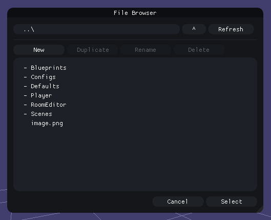

# ImGui FileBrowser
A simple file-browser for [dear-imgui](https://github.com/ocornut/imgui). 



## Usage
1. Add ``imgui_filebrowser.cpp`` to your source files. 
2. Include ``imgui_filebrowser.h``. 

There are two functions: 
```cpp
bool ImGui::OpenFileBrowser(const std::string& InPath, FileBrowserOption InOption = FileBrowserOption::FILE, const std::set<std::string>& InExt = {});
bool ImGui::FetchFileBrowserResult(const std::string& InPath, std::string& OutSelectedPath);
```

There are some QOL tricks in the browser: 
 - Write ".." in the navigation-bar to go up one directory
 - Press tab when editing the navigation-bar to auto-complete
 - You can specify a base directory by changing the path in ``GetRelative()`` and ``GetLocal()``. It is currently set to ``..\\content\\``. 


## Example
```cpp
if (ImGui::Button("Pick file"))
	ImGui::OpenFileBrowser(defaultPath);

std::string result;
if (ImGui::FetchFileBrowserResult(defaultPath, result))
{
	// Do something with the result
}
```

## Notes
 - Using the standard library, specifically ``std::string``, ``std::set`` and ``std::filesystem``.
 - The window size can be changed by changing ``Width`` and ``Height`` in the ``FileBrowser`` class. 

## TODO: 
 - Multi-file select
 - Search / filters
 - Currently relying on that ``defaultPath`` is different for each ``FetchFileBrowserResult()`` call